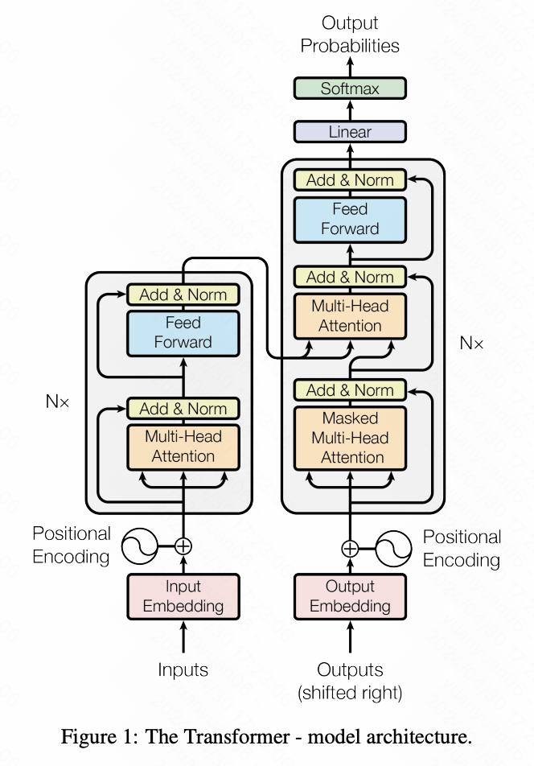

# Transformer结构

> Transformer 架构是在划时代的论文 《Attention Is All You Need》 （[https://arxiv.org/pdf/1706.03762](https://arxiv.org/pdf/1706.03762)）中首次提出的，它通过独特的机制彻底改变了序列建模任务的处理方式。笔者每次读这篇论文都会有新的感受，内容精简且非常经典。

### Transformer模型结构

<figure><figcaption></figcaption></figure>

### 嵌入模型（Embedding）

### 位置编码（Postion Encoding）

由于 Transformer 完全依赖于注意力机制，它本身不像循环神经网络那样具有处理序列数据的固有能力。为了使模型能够理解序列中各个元素的位置信息，Transformer 引入了位置编码。位置编码将每个位置的索引映射到一个高维空间，以便模型可以利用这些信息来了解单词的顺序。这些编码与输入序列的每个元素相加，从而提供关于元素位置的必要线索。

这两个概念的结合不仅优化了模型的学习效率，还提高了其在多种语言处理任务中的表现，特别是在处理具有长距离依赖的复杂序列时。 Transformer 通过这种全新的方法，为处理各种序列数据问题提供了一种更为高效且灵活的框架。

### 多头自注意力机制（Multi-Head Attention）

自注意力机制是 Transformer 架构的核心，它允许模型在处理数据时同时考虑序列中的所有元素之间的关系。这种机制通过计算序列中每个元素对其他所有元素的“关注”权重来工作。每个元素的输出是其自身与序列中所有其他元素的加权组合，其中权重由元素之间的相对关系决定。这使得模型能够捕捉序列内部的复杂依赖关系，极大地提高了处理长距离依赖的能力。

相较于Transformer，Attention机制提出时间甚至可以追溯到2014年，该机制提出后，给CV领域、机器翻译领域等等都带来了巨大的改变，是具有划时代意义的创新，

### Add\&Norm

### 前馈神经网络（Feed Forward）

### 线性层（Linear）

### Softmax层

